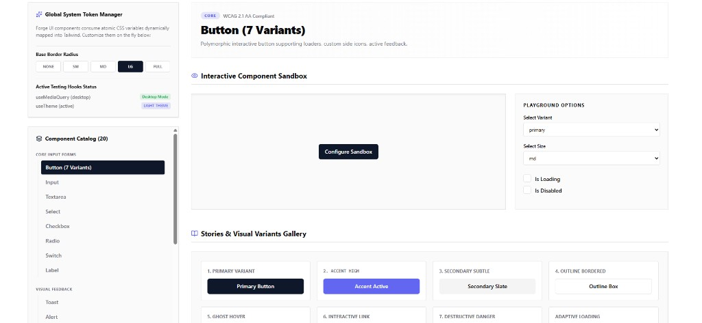

# Forge UI

<div align="center">

**Accessible, themeable React component library with 20 production-ready primitives, atomic design tokens, and a live interactive playground.**

[](https://forge-ui-component-library-668971334330.europe-west2.run.app)
[](https://github.com/mkkbun/forge-ui-component-library)

[](https://react.dev/)
[](https://www.typescriptlang.org/)
[](https://tailwindcss.com/)
[](https://www.w3.org/WAI/WCAG21/quickref/)
[](https://opensource.org/licenses/Apache-2.0)

**[View live showcase →](https://forge-ui-component-library-668971334330.europe-west2.run.app)**

</div>

---

## Live showcase

Explore every component in the browser—no install required. Toggle light/dark theme, adjust global border radius, and use the interactive sandbox to test variants in real time.

| | |
|---|---|
| **Live app** | [https://forge-ui-component-library-668971334330.europe-west2.run.app](https://forge-ui-component-library-668971334330.europe-west2.run.app) |
| **Repository** | [github.com/mkkbun/forge-ui-component-library](https://github.com/mkkbun/forge-ui-component-library) |



*Interactive playground: global design tokens, 20-component catalog, live sandbox, and visual variant gallery.*

---

## About

**Forge UI** is a modern React design system for teams who want polished UI without sacrificing accessibility or customization. Components map to **atomic CSS variables** that sync with **Tailwind CSS v4**, so you can retheme the entire library from a single token layer. Overlays (modal, drawer, popover, tooltip, dropdown) build on **Radix UI** for focus management and keyboard support.

### What you get

- **20 components** across forms, feedback, overlays, and data display  
- **Global Token Manager** — change border radius and theme live in the showcase  
- **Interactive sandbox** — tweak variant, size, loading, and disabled states per component  
- **Stories gallery** — visual reference for all Button variants (and presets for the rest)  
- **Copy-paste snippets** — ready-to-use React examples in the docs panel  
- **Light & dark mode** with `localStorage` persistence via `ThemeProvider`  
- **TypeScript-first** exports for props, variants, and design tokens  

---

## Table of contents

- [Live showcase](#live-showcase)
- [Features](#features)
- [Component catalog](#component-catalog)
- [Quick start](#quick-start)
- [Usage in your app](#usage-in-your-app)
- [Theming](#theming)
- [Project structure](#project-structure)
- [Scripts](#scripts)
- [Accessibility](#accessibility)
- [License](#license)

---

## Features

| Area | Details |
|------|---------|
| **20 components** | Forms, feedback, overlays, and data display |
| **Design tokens** | CSS variables (`--forge-*`) mapped into Tailwind `@theme` |
| **Theme provider** | Light/dark mode, persisted preferences, runtime token overrides |
| **Radix primitives** | Modal, drawer, popover, tooltip, dropdown, avatar |
| **Polymorphic API** | e.g. `Button` supports `as` for links and custom elements |
| **Live playground** | Deployed showcase on Google Cloud Run |
| **TypeScript** | Exported props and variant types from `packages/forge-ui` |

---

## Component catalog

### Core (forms)

| Component | Description |
|-----------|-------------|
| `Button` | 7 variants (`primary`, `accent`, `secondary`, `outline`, `ghost`, `link`, `danger`), sizes, loading state, icons |
| `Input` | Label, helper text, error state, left/right addons |
| `Textarea` | Multi-line input with validation styling |
| `Select` | Styled native `<select>` wrapper |
| `Checkbox` | Custom checkbox with focus rings |
| `Radio` / `RadioGroup` | Grouped options via React context |
| `Switch` | Accessible toggle |
| `Label` | Form labels with optional `required` indicator |

### Feedback

| Component | Description |
|-----------|-------------|
| `ToastProvider` / `useToast` | Stacked toast notifications |
| `Alert` | Semantic status panels |
| `Spinner` | Loading indicator (sm / md / lg) |
| `Skeleton` | Text, circular, and rectangular placeholders |
| `Progress` | Animated progress bar |

### Overlay

| Component | Description |
|-----------|-------------|
| `Modal` | Dialog with focus trap (Radix) |
| `Drawer` | Side panel (left or right) |
| `Popover` | Anchored content card |
| `Tooltip` | Hover/focus labels |
| `DropdownMenu` | Context menus with destructive items |

### Data

| Component | Description |
|-----------|-------------|
| `DataTable` | Sorting, search, pagination |
| `Badge` | Status and category tags |
| `Avatar` | Image with initials fallback |

### Hooks

- `useTheme` — theme mode and token updates  
- `useMediaQuery` / `usePrefersReducedMotion` — responsive and a11y helpers  

---

## Quick start

### Prerequisites

- [Node.js](https://nodejs.org/) 18+ (20+ recommended)
- npm, pnpm, or yarn

### Run locally

```bash
git clone https://github.com/mkkbun/forge-ui-component-library.git
cd forge-ui-component-library
npm install
npm run dev
```

Open **http://localhost:3000** — same experience as the [live showcase](https://forge-ui-component-library-668971334330.europe-west2.run.app).

### Build for production

```bash
npm run build
npm run preview
```

---

## Usage in your app

The library lives under `packages/forge-ui/`. Import it via path (npm publish coming later).

### 1. Copy or link the package

Copy `packages/forge-ui` into your project, or add a workspace alias in your bundler.

### 2. Wrap your app

```tsx
import { ThemeProvider, ToastProvider } from "./packages/forge-ui/src";
import "./index.css"; // Tailwind + Forge token mappings (see src/index.css)

export default function App() {
  return (
    <ThemeProvider>
      <ToastProvider>
        <YourApp />
      </ToastProvider>
    </ThemeProvider>
  );
}
```

### 3. Import components

```tsx
import { Button, Input, Badge } from "./packages/forge-ui/src";

export function ProfileForm() {
  return (
    <>
      <Input label="Email" placeholder="you@example.com" />
      <Button variant="primary">Save</Button>
      <Badge variant="success">Active</Badge>
    </>
  );
}
```

### Button example

```tsx
import { Button } from "./packages/forge-ui/src";
import { Sparkles } from "lucide-react";

<Button variant="accent" size="lg" leftIcon={<Sparkles className="h-4 w-4" />}>
  Get started
</Button>
```

Peer dependencies: **React**, **Radix UI**, **lucide-react**, and **Tailwind CSS v4** with the token setup from `src/index.css`.

---

## Theming

Forge UI maps design tokens to CSS custom properties (`--forge-*`), consumed by Tailwind in `@theme`:

```tsx
import { useTheme } from "./packages/forge-ui/src";

function ThemeControls() {
  const { theme, toggleTheme, updateTokens, resetTokens } = useTheme();
  return (
    <button type="button" onClick={toggleTheme}>
      Current: {theme}
    </button>
  );
}
```

- **Persistence:** `localStorage` keys `forge-theme` and `forge-tokens`  
- **Dark mode:** `ThemeProvider` toggles the `dark` class on `<html>`  
- **Runtime overrides:** `updateTokens()` / `resetTokens()`  

Token definitions: `packages/forge-ui/src/theme/tokens.ts`.

---

## Project structure

```text
forge-ui-component-library/
├── docs/showcase.png          # README preview screenshot
├── packages/forge-ui/src/     # Component library
│   ├── components/
│   ├── theme/
│   ├── hooks/
│   └── index.ts
├── src/
│   ├── App.tsx                # Interactive showcase
│   ├── index.css
│   └── main.tsx
├── vite.config.ts
└── package.json
```

---

## Scripts

| Command | Description |
|---------|-------------|
| `npm run dev` | Dev server on port **3000** |
| `npm run build` | Production build → `dist/` |
| `npm run preview` | Preview production build |
| `npm run lint` | Type-check (`tsc --noEmit`) |
| `npm run clean` | Remove `dist/` |

```bash
npx vitest run packages/forge-ui/src/components/Button/Button.test.tsx
```

---

## Accessibility

Semantic HTML, visible focus rings, and Radix UI for overlays (focus trap, keyboard navigation, ARIA). The showcase labels components as **WCAG 2.1 AA** oriented—validate in your own app with axe or Lighthouse before production.

---

## License

**Apache License 2.0** — see [Apache License 2.0](https://www.apache.org/licenses/LICENSE-2.0). Source files use `SPDX-License-Identifier: Apache-2.0`.

---

<div align="center">

**[Live showcase](https://forge-ui-component-library-668971334330.europe-west2.run.app)** · **[GitHub](https://github.com/mkkbun/forge-ui-component-library)** · Built with React, TypeScript, Tailwind CSS, and Radix UI

</div>
